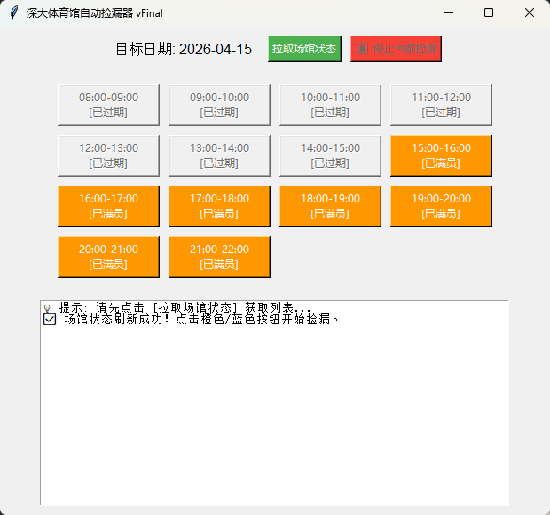

# 🏸 深大健身房自动捡漏器 (SZU Gym Helper)


基于 Python + Tkinter 编写的深圳大学体育场馆全自动捡漏工具。告别手动刷新，释放你的双手，让机器为你盯盘！

## ✨ 核心特性

- 🖥️ **可视化操作界面**：告别黑框框，直观的按钮排版，一键拉取当日所有场馆状态。
- ⚡ **毫秒级并发打击**：采用直接 POST 提交订单的底层协议模式，比正常网页点击快 N 倍。
- 🛡️ **防假死与线程安全**：底层的无限轮询捡漏运行在独立线程，界面绝不卡顿；日志输出采用线程安全队列。
- 🛑 **随时启停**：发现抢错了？随时点击“停止当前捡漏”，毫秒级中断发送，安全可靠。
- 📊 **智能日志分析**：实时打印服务器真实的 JSON 返回状态，不再被模糊的报错蒙蔽双眼。

## 🚀 界面预览

## 🛠️ 安装与使用

### 1. 环境准备
确保你的电脑上已经安装了 Python 3.x 环境。

### 2. 克隆仓库
```bash
git clone [https://github.com/Georgeupup/szu_gym_helper.git](https://github.com/Georgeupup/szu_gym_helper.git)
cd szu_gym_helper
```

### 3. 安装依赖库
本程序仅依赖 `requests` 库进行网络请求，无需安装繁杂的第三方包。
```bash
pip install requests
```

### 4. 获取并配置 Cookie
程序需要你的授权身份才能帮你抢票。
1. 请参考底部的 [👉 小白零门槛抓 Cookie 教程](#-小白零门槛抓-cookie-教程图文版指南) 获取你的专属 Cookie。
2. 用文本编辑器（如 VS Code、记事本）打开 `szu_gym_helper.py`。
3. 找到代码顶部的配置区，修改以下信息：
```python
# 粘贴你刚刚抓到的那一长串Cookie
YOUR_LATEST_COOKIE = "_WEU=xxxxxx; MOD_AUTH_CAS=xxxxxx; JSESSIONID=xxxxxx"
```

### 5. 运行程序
```bash
python szu_gym_helper.py
```
运行后，点击“拉取场馆状态”，然后点击对应时间段的橙色（已满员）或蓝色（可预约）按钮，静候佳音即可！🎉

---

## 📖 小白零门槛抓 Cookie 教程（图文版指南）

对于没有抓包经验的同学，请严格按照以下步骤操作，1 分钟即可搞定：

**准备工作：** 请使用电脑，连接校园网并打开 Google Chrome 或 Microsoft Edge 浏览器。

1. **登录系统**：在电脑浏览器中，打开深大网上办事大厅（ehall.szu.edu.cn），并正常登录。
2. **进入系统**：找到并点击进入“体育场馆预约”的界面。
3. **打开开发者工具**：
   - 按下键盘上的 `F12` 键（如果是笔记本，可能需要按 `Fn + F12`）。
   - 或者在网页空白处 **右键 -> 检查 (Inspect)**。
4. **切换面板**：在弹出的开发者工具窗口顶部，找到并点击 **Network（或“网络”）** 标签页。
5. **抓取请求**：按 `F5` 刷新当前网页。此时你会看到 Network 面板里刷出了一大堆请求记录。
6. **定位目标**：
   - 在 Network 面板的搜索框（Filter/筛选）里，输入 `lwSzuCgyy.do` 或者 `index.do`。
   - 在下面的列表中，点击出现的那条请求记录。
7. **复制 Cookie**：
   - 在右侧弹出的详情面板中，点击 **Headers（标头）**。
   - 向下滚动，找到 **Request Headers（请求标头）** 这一块。
   - 在里面找到名为 `Cookie:` 的字段。
   - **将 `Cookie:` 后面的那一长串字符（通常包含 `_WEU=...; MOD_AUTH_CAS=...; JSESSIONID=...`）完整复制下来，填入代码中即可！**

> **⚠️ 注意：** Cookie 就像你的临时身份证，是有有效期的。如果软件提示“Cookie已失效”或“异常拦截”，请重新按照上述步骤抓取一次最新的 Cookie 替换。

---

## ⚠️ 免责声明 (Disclaimer)

1. **账号安全**：Cookie 相当于你的个人身份凭证，**请绝对不要将带有你自己 Cookie 的代码上传到 GitHub 或分享给他人！** 开源或分享前，请务必确保清空 `YOUR_LATEST_COOKIE` 字段。
2. **仅供学习交流**：本工具仅作 Python 网络爬虫、多线程编程及 GUI 开发的学习交流之用。
3. **合理使用**：代码中已内置了请求频率限制（2.5秒/次）。请勿为了极速抢票随意移除休眠时间进行极端高频发包，否则容易导致你的校园网 IP 被校方防火墙封禁。因滥用此工具产生的一切后果由使用者自行承担。

## 💡 贡献与支持
如果你在使用过程中发现了 Bug，或者有更好的优化建议，欢迎提交 Pull Request 或者 Issue！
如果你觉得这个小工具帮到了你，请点个 ⭐ Star 支持一下吧！
